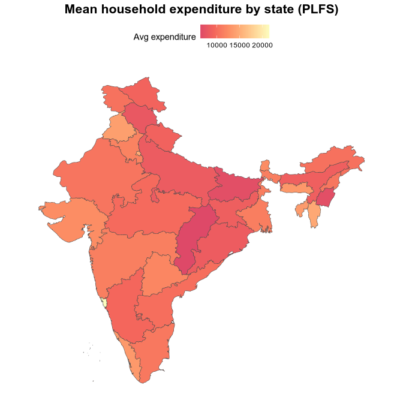

<!-- README.md is generated from README.Rmd. Please edit that file -->

<!-- badges: start -->

[](https://github.com/pachadotdev/rahulsh97/actions/workflows/R-CMD-check.yaml)
<!-- badges: end -->

# Periodic Labour Force Survey (PLFS)

The goal of plfs is to provide a long dataset of the Periodic Labour
Force Survey (PLFS) from India.

## Example

Install the package from GitHub and load it:

``` r
# install.packages("devtools")
devtools::install_github("rahulsh97/plfs")
```

``` r
library(plfs)
```

Because of the datasets size, the package provides a function to
download the datasets and create a local DuckDB database. This results
in a CRAN-compliant package.

Here is how to get the plfs database ready for use:

``` r
plfs_download()
```

Check the proportion of observations by Social Group (b3q4_hhv1) in the
survey (See
<https://microdata.gov.in/NADA/index.php/catalog/213/data-dictionary/F5>):

``` r
library(dplyr)
#> 
#> Attaching package: 'dplyr'
#> The following objects are masked from 'package:stats':
#> 
#>     filter, lag
#> The following objects are masked from 'package:base':
#> 
#>     intersect, setdiff, setequal, union
library(duckdb)
#> Loading required package: DBI

con <- dbConnect(duckdb(), plfs_file_path())

dbListTables(con)
#>  [1] "2021-22-hhrv"  "2021-22-hhv1"  "2021-22-perrv" "2021-22-perv1"
#>  [5] "2022-23-hhrv"  "2022-23-hhv1"  "2022-23-perrv" "2022-23-perv1"
#>  [9] "2023-24-hhrv"  "2023-24-hhv1"  "2023-24-perrv" "2023-24-perv1"

tbl(con, "2021-22-hhrv") %>%
  count()
#> # Source:   SQL [?? x 1]
#> # Database: DuckDB 1.4.0 [pacha@Linux 6.12.48-1-MANJARO:R 4.5.1//home/pacha/.local/share/R/plfs/plfs_duckdb_v140.sql]
#>        n
#>    <dbl>
#> 1 132376

tbl(con, "2021-22-hhrv") %>%
  count(b3q4_hhrv) %>%
  mutate(
    b3q4_hhrv = case_when(
      b3q4_hhrv == 1L ~ "scheduled tribe",
      b3q4_hhrv == 2L ~ "scheduled caste",
      b3q4_hhrv == 3L ~ "other backward class",
      b3q4_hhrv == 9L ~ "other",
      TRUE ~ NA_character_
    ),
    pct = n / sum(n)
  ) %>%
  collect()
#> Warning: Missing values are always removed in SQL aggregation functions.
#> Use `na.rm = TRUE` to silence this warning
#> This warning is displayed once every 8 hours.
#> # A tibble: 4 × 3
#>   b3q4_hhrv                n    pct
#>   <chr>                <dbl>  <dbl>
#> 1 scheduled tribe      10927 0.0825
#> 2 scheduled caste      17566 0.133 
#> 3 other backward class 54162 0.409 
#> 4 other                49721 0.376

# what happened from 2021 to 2022

d <- tbl(con, "2021-22-hhrv") %>%
  count(b3q4_hhrv) %>%
  mutate(
    b3q4_hhrv = case_when(
      b3q4_hhrv == 1L ~ "scheduled tribe",
      b3q4_hhrv == 2L ~ "scheduled caste",
      b3q4_hhrv == 3L ~ "other backward class",
      b3q4_hhrv == 9L ~ "other",
      TRUE ~ NA_character_
    ),
    pct = n / sum(n)
  ) %>%
  left_join(
    tbl(con, "2022-23-hhrv") %>%
      count(b3q4_hhrv) %>%
      mutate(
        b3q4_hhrv = case_when(
          b3q4_hhrv == 1L ~ "scheduled tribe",
          b3q4_hhrv == 2L ~ "scheduled caste",
          b3q4_hhrv == 3L ~ "other backward class",
          b3q4_hhrv == 9L ~ "other",
          TRUE ~ NA_character_
        ),
        pct = n / sum(n)
      ),
      by = "b3q4_hhrv"
  ) %>%
  collect()

dbDisconnect(con, shutdown = TRUE)
```

A more sophisticated example to plot a map:

``` r
library(dplyr)
library(duckdb)
library(readxl)
library(rnaturalearth)
library(sf)
#> Linking to GEOS 3.13.1, GDAL 3.11.3, PROJ 9.6.0; sf_use_s2() is TRUE
library(stringr)
library(ggplot2)

con <- dbConnect(duckdb(), plfs_file_path())

dbListTables(con)
#>  [1] "2021-22-hhrv"  "2021-22-hhv1"  "2021-22-perrv" "2021-22-perv1"
#>  [5] "2022-23-hhrv"  "2022-23-hhv1"  "2022-23-perrv" "2022-23-perv1"
#>  [9] "2023-24-hhrv"  "2023-24-hhv1"  "2023-24-perrv" "2023-24-perv1"

# average household expenditure by state

state_codes <- read_excel("District_codes_PLFS_Panel_4_202324_2024.xlsx", range = "A4:D698")

state_codes <- state_codes %>%
  select(state_name = `State Name`, state_code = `State Code`) %>%
  distinct()

mean_expenditure <- tbl(con, "2023-24-hhv1") %>%
  group_by(state_code = state_hhv1) %>%
  summarise(
    avg_expenditure = mean(b3q5pt1_hhv1, na.rm = TRUE)
  ) %>%
  collect()

dbDisconnect(con, shutdown = TRUE)

mean_expenditure <- mean_expenditure %>%
  left_join(state_codes, by = "state_code")

india_states <- rnaturalearth::ne_states(country = "India", returnclass = "sf") %>%
  select(geom_name = name, geometry) %>%
  st_as_sf()

# normalize names
norm <- function(x) {
  x %>%
    toupper() %>%
    str_replace_all("&", "AND") %>%
    str_replace_all("&", "AND") %>%
    str_replace_all("[^A-Z0-9]", "") %>%
    str_squish()
}

india_states <- india_states %>%
  mutate(name_norm = norm(geom_name))

mean_expenditure <- mean_expenditure %>%
  mutate(state_name_norm = norm(state_name))

match_idx <- stringdist::amatch(mean_expenditure$state_name_norm,
  india_states$name_norm, method = "jw", maxDist = 0.18)

unmatched <- which(is.na(match_idx))

if (length(unmatched) > 0) {
  message("Unmatched rows in mean_expenditure (no fuzzy match found). Print them to fix manually:")
  print(mean_expenditure[unmatched, "state_name_norm"])
}
#> Unmatched rows in mean_expenditure (no fuzzy match found). Print them to fix manually:
#> # A tibble: 2 × 1
#>   state_name_norm          
#>   <chr>                    
#> 1 AANDNISLANDS             
#> 2 DAMANANDDIUANDDANDNHAVELI

sort(india_states$name_norm)
#>  [1] "ANDAMANANDNICOBAR"                 "ANDHRAPRADESH"                    
#>  [3] "ARUNACHALPRADESH"                  "ASSAM"                            
#>  [5] "BIHAR"                             "CHANDIGARH"                       
#>  [7] "CHHATTISGARH"                      "DADRAANDNAGARHAVELIANDDAMANANDDIU"
#>  [9] "DELHI"                             "GOA"                              
#> [11] "GUJARAT"                           "HARYANA"                          
#> [13] "HIMACHALPRADESH"                   "JAMMUANDKASHMIR"                  
#> [15] "JHARKHAND"                         "KARNATAKA"                        
#> [17] "KERALA"                            "LADAKH"                           
#> [19] "LAKSHADWEEP"                       "MADHYAPRADESH"                    
#> [21] "MAHARASHTRA"                       "MANIPUR"                          
#> [23] "MEGHALAYA"                         "MIZORAM"                          
#> [25] "NAGALAND"                          "ODISHA"                           
#> [27] "PUDUCHERRY"                        "PUNJAB"                           
#> [29] "RAJASTHAN"                         "SIKKIM"                           
#> [31] "TAMILNADU"                         "TELANGANA"                        
#> [33] "TRIPURA"                           "UTTARAKHAND"                      
#> [35] "UTTARPRADESH"                      "WESTBENGAL"

# DAMANANDDIUANDDANDNHAVELI -> DADRAANDNAGARHAVELIANDDAMANANDDIU
mean_expenditure <- mean_expenditure %>%
  mutate(
    state_name_norm = case_when(
      state_name_norm == "DAMANANDDIUANDDANDNHAVELI" ~
        "DADRAANDNAGARHAVELIANDDAMANANDDIU",
      TRUE ~ state_name_norm
    )
  ) %>%
  left_join(
    india_states,
    by = c("state_name_norm" = "name_norm")
  )

mean_expenditure %>%
  filter(is.na(geom_name))
#> # A tibble: 1 × 6
#>   state_code avg_expenditure state_name    state_name_norm geom_name
#>   <chr>                <dbl> <chr>         <chr>           <chr>    
#> 1 35                  18247. A & N ISLANDS AANDNISLANDS    <NA>     
#> # ℹ 1 more variable: geometry <MULTIPOLYGON [°]>

ggplot(mean_expenditure) +
  geom_sf(aes(fill = avg_expenditure, geometry = geometry), colour = "grey30", size = 0.2) +
  scale_fill_viridis_c(option = "magma", begin = 0.6, end = 1, na.value = "grey95", name = "Avg expenditure") +
  labs(title = "Mean household expenditure by state (PLFS)") +
  theme_minimal() +
  theme(
    axis.text = element_blank(),
    axis.ticks = element_blank(),
    panel.grid = element_blank(),
    plot.title = element_text(hjust = 0.5, size = 16, face = "bold"),
    legend.position = "top"
  )
```



# Adding older/newer years

Be sure to use the yearly survey (e.g., Jul 23 - Jun 24,
<https://microdata.gov.in/NADA/index.php/catalog/PLFS/?page=1&sort_order=desc&ps=15&repo=PLFS>)

1.  Install the Nesstar Explorer (e.g. plfs 2023-24 includes it)
2.  Extract the RAR/ZIP files downloaded from the microdata website to
    data-raw/202324 or what year you are adding
3.  Export the .Nesstar file to Stata (SAV) format with “Export
    Datasets” and the metadata with “Export DDI” using the Nesstar
    Explorer
4.  Update `00-tidy-data.r` and run it
5.  Update the available datasets in `R/available_datasets.R`
6.  Update the new RDS files in the ‘Releases’ section of the GitHub
    repository
7.  Regenerate the database with `plfs_delete()` and `plfs_download()`
